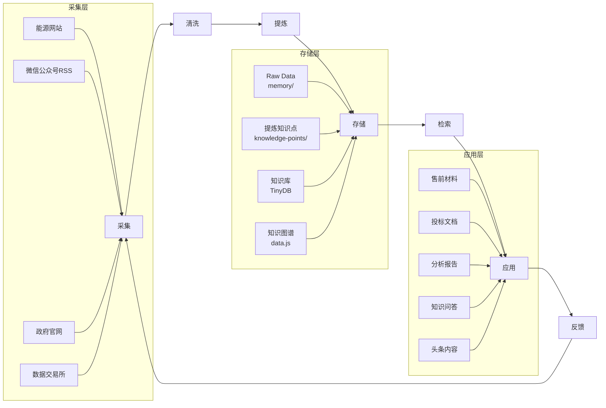
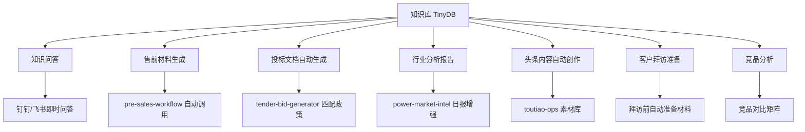
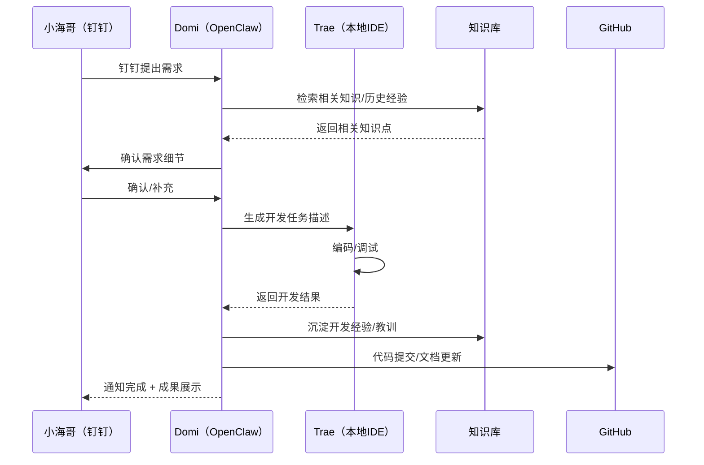

# Domi 知识体系规划方案 v1.0

> 编制：Domi | 日期：2026-04-21
> 面向用户：小海哥（李军召）
> 核心定位：以 **OpenClaw 为知识中枢**，支撑能源/数据要素领域的全链路知识管理

---

## 第一部分：现状盘点

### 1.1 已有知识资产

#### 知识库（TinyDB）
- **位置**：`knowledge/db/knowledge-index.json`
- **规模**：**414 条知识点**，覆盖朗新科技、可信数据空间、数据基础设施、充电桩、虚拟电厂等
- **时间跨度**：2026-04-13 至今积累
- **数据质量**：每条含 `quality` 评分、`source` 来源、`archive_url` CDN 溯源链接

#### 知识图谱（可视化）
- **在线地址**：https://domi-openclaw.github.io/code-space/knowledge-graph/
- **数据源**：TinyDB → `sync-generator.py` → `data.js` + `summaries.js` → GitHub Pages
- **图谱结构**：约 60 个实体、80 条关系，涵盖政策体系、区域节点、业务关联三大维度
- **实体分类**：政策文件、技术标准、行业指引、企业、产品/业务、平台、技术概念、数据概念

#### 长期记忆（MEMORY.md）
- **定位**：跨会话长期规范 + 仍在运行的产品
- **核心沉淀**：电力现货价格预测 API、新能源消纳预测、知识库单一写入原则、系统性根因防御

#### 行业资源库
- **`website-resources.md`**：12个数据交易所 + 国家部委 + 监管机构网址合集（v3.0，已验证可访问性）
- **`energy-business-vision-v1.md`**：基于可信数据空间的能源业务场景构想（v1.0）
- **`new_energy_capacity.json`**：31省光伏+风电基础数据底座

### 1.2 已有采集通道

| 通道 | 技术 | 触发方式 | 产出物 | 运行状态 |
|------|------|----------|--------|---------|
| **北极星电力网** | Browser snapshot | cron 07:15 + 手动 | `memory/YYYY-MM-DD-energy-news.md` | ✅ 稳定 |
| **中国能源新闻网** | Browser snapshot | cron 07:15 + 手动 | 同上 | ✅ 稳定 |
| **RMI 落基山研究所** | web_fetch | cron 07:15 + 手动 | 同上 | ✅ 稳定 |
| **能见Eknower** | web_fetch/Browser | cron 07:15 | 同上 | ⚠️ 不稳定 |
| **中电联** | web_fetch/Browser | cron 07:15 | 同上 | ✅ 稳定 |
| **微信公众号（RSS）** | RSS/Atom（localhost:4000） | cron 07:15 | `memory/YYYY-MM-DD-wechat-articles.md` | ✅ 稳定 |
| **电力市场情报系统** | 5Agent 多Agent协作 | cron 定时 | `power-market-intel/memory/daily-report.md` | ✅ 运行中 |
| **招投标情报** | `bid-intel-collection` | 手动触发 | skill/memory/ 目录 | ✅ 运行中 |

### 1.3 现有 BCF 业务专家层 Skill 清单

| Skill 名称 | 领域 | 架构 | 状态 |
|-----------|------|------|------|
| **energy-news-monitor** | 能源新闻采集 | 六层完整 | ✅ 稳定运行 |
| **wechat-official-accounts-scan** | 公众号RSS采集 | 六层完整 | ✅ 稳定运行 |
| **power-market-intel** | 电力市场情报（5Agent） | 六层完整 | ✅ 运行中 |
| **data-market-insight** | 数据要素市场情报 | 六层完整 v2.1 | ✅ 运行中 |
| **pre-sales-workflow** | 售前全流程（BD/投标/复盘） | 六层完整 | ✅ 运行中 |
| **bcf-meta** | BCF Skill工厂（构建/质检/升级） | 七维4.57分 | ✅ 运行中 |
| **knowledge-management** | 知识沉淀统一入口 | TinyDB 唯一写库 | ✅ 核心枢纽 |

### 1.4 现有知识分类规则

**知识库入库过滤规则**（learn.py 内置）：
- ✅ **全部入库**：政策文件（p/miit/ndrc/nea等）、招投标（行业关键词+公告类型）
- ❌ **排除**：新闻/商业媒体（今日头条、网易、新浪财经等）

**电力市场相关度分级**（统一标准）：
- **高相关**：电力交易规则、储能/虚拟电厂政策、电价机制、电力市场改革
- **中相关**：新能源装机、源网荷储、电力设备、能源央企合作
- **低相关**：能源转型、碳排放、国际能源事件

### 1.5 现有 cron 任务

| 时间 | 任务 | 命令 |
|------|------|------|
| 07:15 每日 | 能源新闻采集 | `energy-news-monitor/scripts/run_daily.sh` |
| 07:15 每日 | 公众号文章采集 | `wechat-official-accounts-scan/scripts/daily_collect.py` |
| 23:00 每日 | 知识沉淀 | `knowledge-management/scripts/learn.py` |
| 10:00 每日 | 知识图谱 GitHub Sync | cron（OpenClaw内置） |
| 00:30 每日 | 知识图谱同步 | cron ID: 555566ef |

---

## 第二部分：目标架构

### 2.1 知识生命周期



### 2.2 分层存储架构

| 层级 | 存储位置 | 数据形态 | 保留策略 | 示例 |
|------|---------|---------|---------|------|
| **L0 原始采集** | `memory/YYYY-MM-DD-*.md` | 新闻条目、文章列表 | 7天后自动清理 | 当日新闻采集结果 |
| **L1 加工数据** | `memory/` 按日期归档 | 带摘要和相关度评级的文章 | 30天压缩为周报 | 公众号文章清洗结果 |
| **L2 情报报告** | `skills/*/memory/daily-report.md` | Agent 生成的日报/分析报告 | 永久保留，按月归档 | 电力市场日报 |
| **L3 知识点** | `knowledge-points/*.json` | 结构化知识点（提炼后） | 永久保留 | 政策文件核心条款 |
| **L4 知识库** | `knowledge/db/knowledge-index.json`（TinyDB） | 去重后的最终知识库 | **永久，唯一写入口** | 414条知识点 |
| **L5 知识图谱** | GitHub Pages `data.js` + `knowledge-graph.md` | 实体关系可视化 | 自动同步，永久保留 | 60+实体80+关系 |

### 2.3 目标知识分类体系

```
知识体系
├── 📜 政策类
│   ├── 国家政策（发改委/能源局/数据局）
│   ├── 地方政策（各省电力市场规则）
│   └── 行业标准（NDI-TR系列、TC609系列）
│
├── 📊 市场类
│   ├── 电力市场（现货/中长期/辅助服务）
│   ├── 数据交易市场（各交易所动态）
│   ├── 绿电/绿证市场
│   └── 储能市场（工商业/独立储能）
│
├── 🔧 技术类
│   ├── 可信数据空间技术（隐私计算/区块链/连接器）
│   ├── 预测算法（电价预测/新能源预测/负荷预测）
│   ├── AI/大模型（时序预测/智能体）
│   └── 新能源技术（光伏/风电/储能）
│
├── 💼 商业类
│   ├── 企业画像（朗新科技/南网/电网公司）
│   ├── 商业模式（虚拟电厂/充电运营/售电）
│   ├── 竞品分析
│   └── 招投标情报
│
└── 📈 运营类
    ├── 售前材料模板
    ├── 拜访纪要
    ├── 会议纪要
    └── 头条运营数据
```

### 2.4 知识溯源机制

| 溯源维度 | 实现方式 | 示例 |
|---------|---------|------|
| **来源标注** | 每条知识点含 `source` + `source_date` | `source: 朗新科技集团中文画册2025` |
| **CDN 归档链接** | `archive_url` → jsDelivr CDN 全文可查 | `cdn.jsdelivr.net/gh/Domi-OpenClaw/file-storage@main/...` |
| **采集文件溯源** | 知识点关联原始 `memory/` 文件名 | 可从 memory 追溯到采集当日原始数据 |
| **知识图谱关系溯源** | `knowledge-graph.md` 中每个关系标注来源文件 | 关系可回溯至 knowledge-index 条目 |
| **入库时间戳** | `learned_date` 字段记录沉淀日期 | `2026-04-17` |

**溯源不可丢原则**：所有知识点必须带来源文件 CDN URL，禁止只写锚点。

---

## 第三部分：实施路径

### Phase 1：基础加固（当前 ~ 2026-05-15）

**目标**：巩固现有体系，消除薄弱点，确保所有链路稳定运行

| 任务 | 优先级 | 说明 |
|------|--------|------|
| **能见度Eknower 稳定性修复** | 🔴 高 | 当前标注 unstable，需替换采集方案或降级为搜索获取 |
| **知识库质量评估** | 🔴 高 | 414条知识点的 `success_rate` 全为 null，需建立评估机制 |
| **knowledge-points/ 目录标准化** | 🟡 中 | 当前由 learn.py 写入但目录结构不够清晰，建议按主题分区 |
| **BCF Skill 执行报告规范落地** | 🟡 中 | SOUL.md 规定每个 Skill 执行后必须报结果，检查所有 BCF Skill 是否落实 |
| **memory 文件瘦身** | 🟡 中 | 按日期积累，需建立 7 天自动清理/压缩机制 |
| **知识图谱增量更新验证** | 🟢 低 | 验证 sync-generator.py 的增量更新是否覆盖新增知识点 |

**技术选型**：
- 继续使用 TinyDB（轻量、单文件、已有 414 条数据）
- sync-generator.py 保持现状
- cron 调度保持现状

### Phase 2：能力增强（2026-05-15 ~ 2026-07-01）

**目标**：扩展采集源、打通知识应用场景、引入质量评估

| 任务 | 优先级 | 说明 |
|------|--------|------|
| **新增采集源** | 🔴 高 | 增加：各省能源局官网、各省电力交易中心网站、储能行业媒体 |
| **知识问答系统** | 🔴 高 | 基于 TinyDB + search-routing 构建本地知识问答能力 |
| **知识点 success_rate 体系** | 🟡 中 | 为每条知识点记录被引用次数、应用成功率，定期评估 |
| **投标场景知识自动匹配** | 🟡 中 | pre-sales-workflow 调用知识库，自动匹配相关政策/案例/能力 |
| **知识图谱可视化增强** | 🟡 中 | 增加按主题筛选、时间轴视图、关键词搜索 |
| **知识入库质量门禁** | 🟡 中 | learn.py 增加质量评分自动计算（已有 `quality_computed` 字段，需启用） |
| **多语言支持** | 🟢 低 | 政策文件/情报报告的中英文双语摘要 |

**技术选型**：
- 知识库：TinyDB 继续（如超过 2000 条，考虑迁移至 SQLite）
- 问答：基于 search-routing + TinyDB 查询，无需额外部署
- 质量门禁：在 learn.py 中增加 scoring pipeline

### Phase 3：体系化运营（2026-07-01 及以后）

**目标**：知识体系全面服务于业务，形成自动化知识运营闭环

| 任务 | 优先级 | 说明 |
|------|--------|------|
| **知识库 → 飞书/钉钉文档自动同步** | 🔴 高 | 按主题生成飞书多维表格或钉钉文档，供团队共享 |
| **知识驱动的内容自动生成** | 🔴 高 | 基于知识点自动生成头条文章、周报、月报 |
| **客户画像知识自动更新** | 🟡 中 | 拜访客户前自动从知识库拉取相关政策和竞品情报 |
| **知识体系健康度仪表盘** | 🟡 中 | 可视化展示：知识点增长、采集覆盖率、质量评分、引用热度 |
| **知识图谱 → LLM 上下文增强** | 🟡 中 | 将知识图谱关键关系注入 system prompt，提升回答准确性 |
| **外部知识交换** | 🟢 低 | 与南网数据空间、朗新内部知识库对接（长期） |

---

## 第四部分：能力增强建议

### 4.1 新增采集源建议

| 采集源 | 价值 | 建议接入方式 | 优先级 |
|--------|------|-------------|--------|
| **各省电力交易中心官网** | 现货市场规则、价格信息 | RSS/搜索 | 🔴 高 |
| **国家能源局派出机构** | 地方监管政策 | web_fetch | 🔴 高 |
| **储能行业媒体（储能领跑者联盟等）** | 储能商业动态 | web_fetch/Browser | 🔴 高 |
| **各数据交易所（上海/北京/深圳）** | 数据产品上架、交易动态 | Browser | 🟡 中 |
| **GitHub 能源开源项目** | 技术趋势追踪 | GitHub API | 🟢 低 |
| **论文/研报（知网/ArXiv）** | 学术研究前沿 | 搜索获取 | 🟢 低 |

### 4.2 知识应用场景



**优先落地**：
1. **知识问答**：用户钉钉提问 → Domi 自动检索知识库 → 带溯源链接回答
2. **售前材料增强**：pre-sales-workflow 自动生成方案时，引用知识库中的政策/案例
3. **头条内容自动生成**：从知识点自动提炼适合头条发布的短文

### 4.3 外部系统对接

| 外部系统 | 对接方式 | 数据流向 | 价值 |
|---------|---------|---------|------|
| **飞书多维表格** | `feishu_bitable` API | 知识库 → 飞书（单向同步） | 团队共享、移动端查看 |
| **飞书文档** | `feishu_doc` API | 知识库 → 飞书文档（自动生成报告） | 正式文档输出 |
| **钉钉文档** | 钉钉开放平台 API | 知识库 → 钉钉（按需同步） | 小海哥主力办公场景 |
| **Obsidian** | Markdown 文件导出 | 知识库 → Markdown（离线查看） | 个人知识管理、双链笔记 |
| **GitHub file-storage** | 已有 | 全文归档 → CDN | 知识溯源、全文可查 |
| **GitHub code-space** | 已有 | 知识图谱可视化 | 在线展示 |

**对接原则**：
- **写入口唯一**：只有 `learn.py` 能写入 TinyDB，其他系统均为消费端
- **按需同步**：不实时同步，改为每日/每周批量同步，避免 API 调用过多
- **格式适配**：飞书/钉钉按各自格式转换，Obsidian 直接导出 Markdown

---

## 第五部分：协同开发架构

### 5.1 "钉钉提需求 → 本地 Trae 开发" 工作流支撑



**关键支撑点**：

| 环节 | OpenClaw 能力 | 说明 |
|------|--------------|------|
| **需求理解** | SOUL.md 用户画像 + MEMORY.md 项目记忆 | 理解小海哥的业务背景、技术偏好 |
| **知识检索** | TinyDB + knowledge-graph.md | 快速拉取相关政策和历史经验 |
| **任务拆解** | pre-sales-workflow / bcf-meta | 将大任务拆解为可执行的子任务 |
| **开发协同** | subagent 并发 + exec 工具 | 独立子任务并行执行 |
| **质量保障** | bcf-meta 质检 + SOUL.md 测试原则 | 开发完成后独立 subagent 全量测试 |
| **经验沉淀** | knowledge-management learn.py | 每次开发后自动沉淀经验教训 |

### 5.2 OpenClaw 作为知识中枢的定位

```
┌─────────────────────────────────────────────────────────┐
│                    OpenClaw 知识中枢                      │
├─────────────────────────────────────────────────────────┤
│                                                         │
│  ┌──────────┐  ┌──────────┐  ┌──────────┐  ┌────────┐ │
│  │ 采集层   │→ │ 情报层   │→ │ 知识管理层│→ │ 应用层 │ │
│  │          │  │          │  │          │  │        │ │
│  │ energy-  │  │ power-   │  │ knowledge│  │ 售前   │ │
│  │ monitor  │  │ market-  │  │ -manage  │  │ 投标   │ │
│  │ wechat   │  │ intel    │  │ learn.py │  │ 问答   │ │
│  │ RSS scan │  │ 5Agent   │  │ TinyDB   │  │ 头条   │ │
│  └──────────┘  └──────────┘  └──────────┘  └────────┘ │
│       ↓              ↓             ↓            ↓      │
│  ┌──────────────────────────────────────────────────┐  │
│  │          统一存储层（TinyDB 唯一写入口）            │  │
│  │  knowledge/db/knowledge-index.json                │  │
│  └──────────────────────────────────────────────────┘  │
│       ↓                                                 │
│  ┌──────────────────────────────────────────────────┐  │
│  │  输出层：GitHub Pages 可视化 / 飞书文档 / 钉钉     │  │
│  └──────────────────────────────────────────────────┘  │
│                                                         │
└─────────────────────────────────────────────────────────┘
```

**核心定位**：

1. **知识入口唯一**：所有知识写入只走 `learn.py`，其他系统只读不写
2. **自动化闭环**：采集 → 清洗 → 提炼 → 入库 → 可视化 → 应用，全程 cron 驱动
3. **知识驱动业务**：售前、投标、头条内容等应用层直接消费知识库，不再重复采集
4. **人在回路**：关键决策（需求确认、发布审批）由小海哥在钉钉确认，系统执行

### 5.3 协同开发中的知识流转

| 场景 | 知识来源 | 知识去向 | 流转方式 |
|------|---------|---------|---------|
| 接到售前任务 | TinyDB 知识库 | pre-sales-workflow | 自动检索相关政策/案例 |
| 投标准备 | 招投标知识库 | tender-bid-generator | 解析招标文件→匹配知识点→生成标书 |
| 出差拜访客户 | 客户画像 + 行业知识 | 拜访交流材料 | 自动拉取相关政策、竞品、案例 |
| 开发新工具 | MEMORY.md 经验教训 | bcf-meta 质检 | 避免历史踩坑 |
| 头条内容创作 | 知识点 + 情报报告 | toutiao-ops | 自动提炼可发布内容 |

---

## 附录

### A. 核心文件路径速查

| 组件 | 路径 | 说明 |
|------|------|------|
| **TinyDB 知识库** | `knowledge/db/knowledge-index.json` | 唯一数据源 |
| **知识图谱同步** | `code-space/knowledge-graph/sync-generator.py` | TinyDB → data.js |
| **知识沉淀入口** | `knowledge-management/scripts/learn.py` | 唯一写库脚本 |
| **知识图谱可视化** | https://domi-openclaw.github.io/code-space/knowledge-graph/ | 在线图谱 |
| **知识图谱结构** | `knowledge/knowledge-graph.md` | 实体关系文档 |
| **业务 Skill 清单** | `business__skills.md` | BCF 注册表 |
| **长期记忆** | `MEMORY.md` | 跨会话精选记忆 |
| **日常记录** | `memory/YYYY-MM-DD.md` | 按日归档 |
| **能源新闻** | `memory/YYYY-MM-DD-energy-news.md` | 每日采集 |
| **公众号文章** | `memory/YYYY-MM-DD-wechat-articles.md` | 每日采集 |
| **GitHub 文件库** | Domi-OpenClaw/file-storage | 全文归档 CDN |
| **GitHub 代码库** | Domi-OpenClaw/code-space | 图谱可视化 |

### B. 当前 cron 任务一览

| 时间 | 任务 | 技术 |
|------|------|------|
| 07:15 每日 | 能源新闻采集（5网站） | energy-news-monitor + crontab |
| 07:15 每日 | 公众号文章采集（RSS） | wechat-official-accounts-scan + crontab |
| 10:00 每日 | 知识图谱 GitHub Sync | OpenClaw cron |
| 23:00 每日 | 知识沉淀（所有BCF数据） | knowledge-management learn.py |
| 00:30 每日 | 知识图谱同步 | OpenClaw cron |

### C. 技术栈总览

| 技术 | 用途 | 状态 |
|------|------|------|
| **TinyDB** | 知识库存储（单文件JSON） | 在用，414条 |
| **Python 3.11** | learn.py / sync-generator.py | 在用 |
| **crontab** | 定时采集任务 | 在用 |
| **OpenClaw cron** | 知识沉淀 / 图谱同步 | 在用 |
| **GitHub Pages** | 知识图谱可视化 | 在用 |
| **jsDelivr CDN** | 全文归档分发 | 在用 |
| **RSS/Atom** | 公众号采集 | 在用（localhost:4000） |
| **Browser (Playwright)** | 能源网站采集 | 在用 |
| **search-routing** | 统一搜索入口 | 在用 |
| **feishu_bitable** | 飞书多维表格 | 已集成 |

---

*本规划立足现有资产，不重复造轮子。所有增强建议均可基于现有架构平滑演进。*
